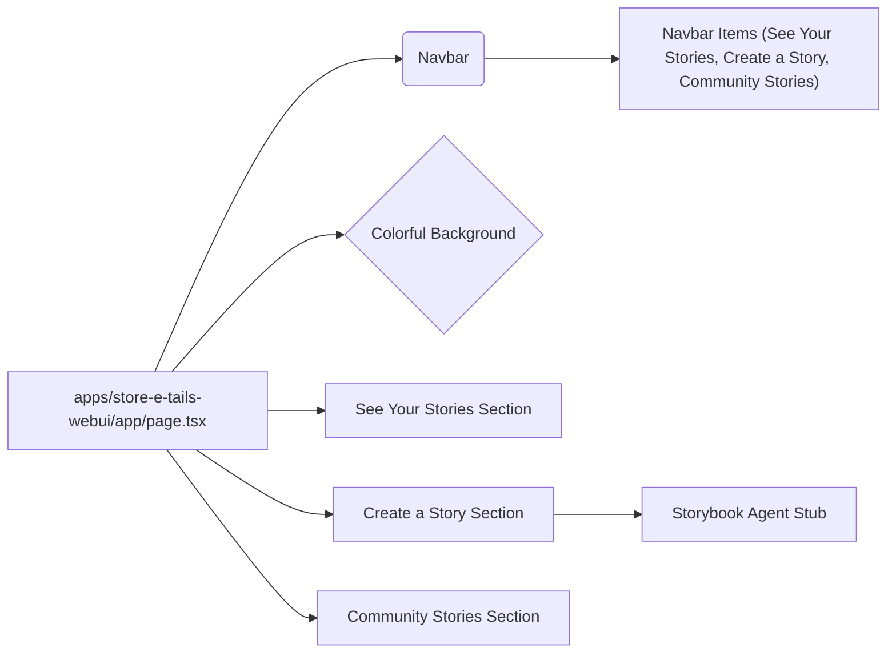

```mermaid
graph LR 
    A["apps/store-e-tails-webui/app/page.tsx"] --> B("Navbar") 
    A --> C{"Colorful Background"} 
    A --> D["See Your Stories Section"] 
    A --> E["Create a Story Section"] 
    A --> F["Community Stories Section"] 
    B --> G["Navbar Items (See Your Stories, Create a Story, Community Stories)"] 
    E --> H["Storybook Agent Stub"]
```